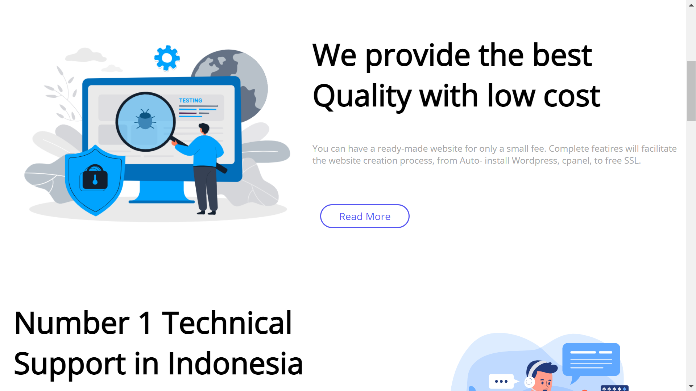
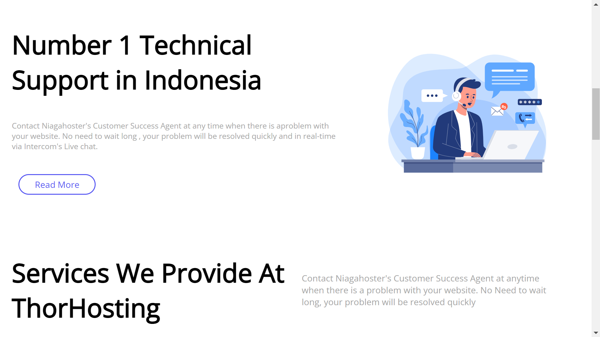
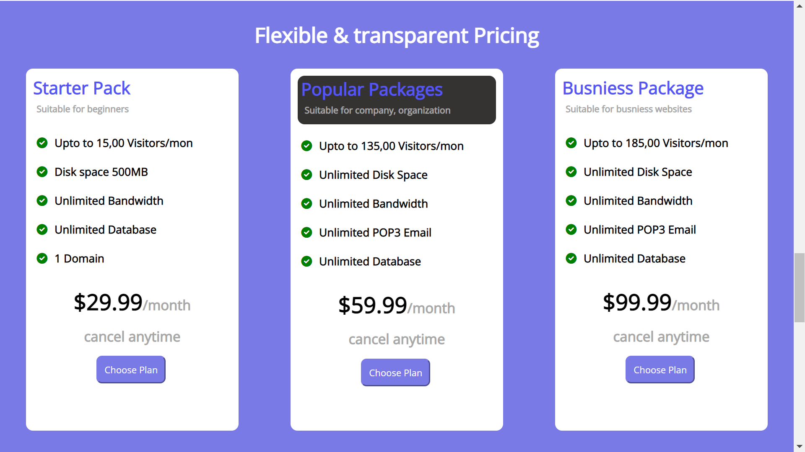
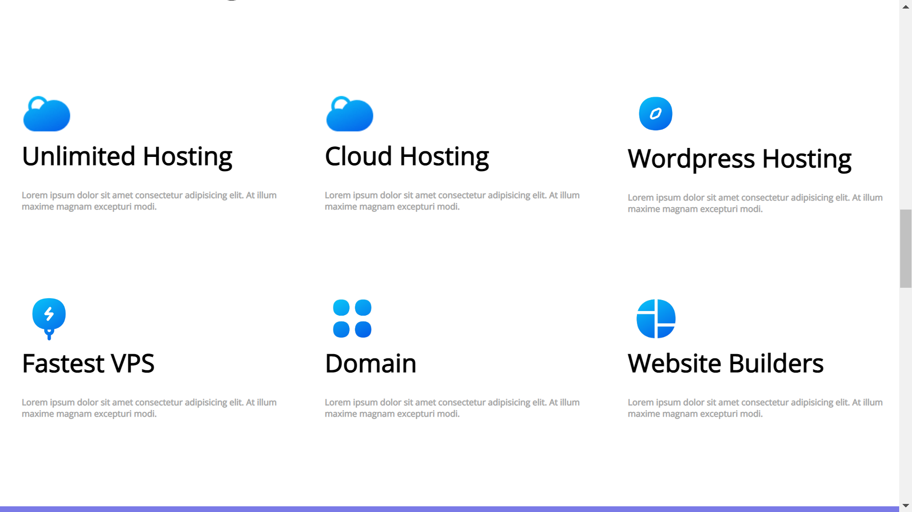
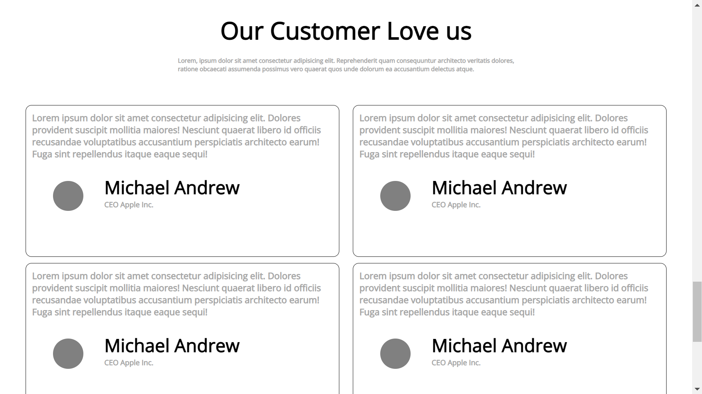
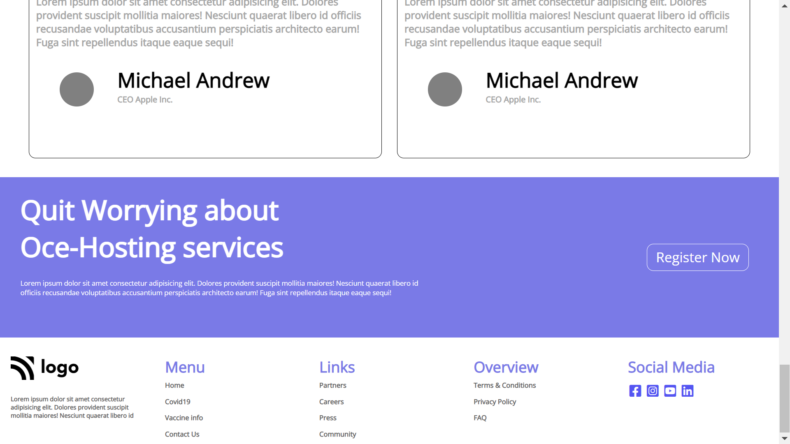

# ASSIGNMENT 11 USING HTML AND CSS

## NAME : NIRAJ VADHER 

In this project I was given the task to make a home page which should look like this

### Target:

### Result:

`ZOOM:100%`
## Learning
In this project i get to learn many thing like
- how to add navigation bar using flex
- how to add icons from [font Awesome](https://fontawesome.com)
- how to use background effectively
- how to align items using flex
## Honest Time of compeletion of project
- `5 hours`

## Live link of project
 - [PROJECT 11]()